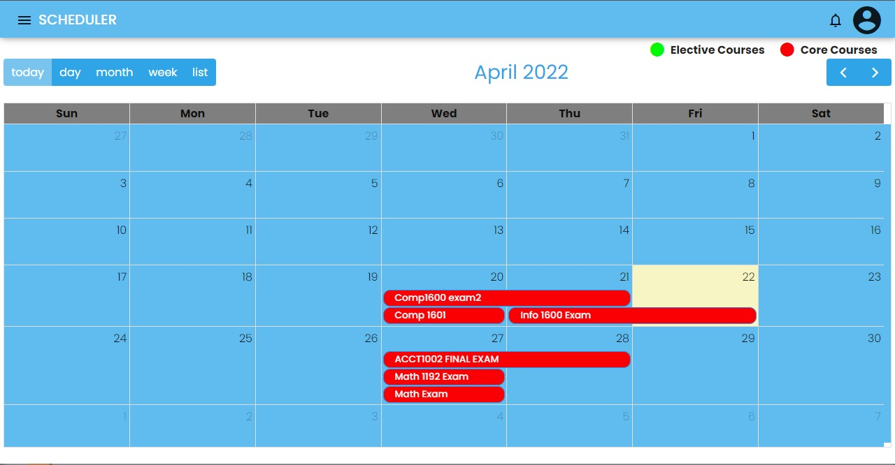

# Coursework Scheduler

Coursework Scheduler is a realtime scheduling application that is intend to facilitate simultaneous scheduling of student assessments while helping lecturers to visual students current workloads utilizing an interactive calendar with various views.

### Technologies used are:
1. [Angular Framework](https://angular.io/)
2. [FullCalendar](https://fullcalendar.io/docs)
3. [Firebase Auth](https://firebase.google.com/docs/auth/web/start) & [Firebase Realtime Database](https://firebase.google.com/docs/database/web/start)

# Gitpod for main branch 
for new branch, add "/tree/branchName"

## Development server

Run `npm run start` for a dev server. Navigate to `http://localhost:4200/`. The app will automatically reload if you change any of the source files.

## Code scaffolding

Run `ng generate component component-name` to generate a new component. You can also use `ng generate directive|pipe|service|class|guard|interface|enum|module`.

## Build

Run `npm run build` to build the project. The build artifacts will be stored in the `dist/` directory. Use the `--prod` flag for a production build.

## Running unit tests

Run `npm run test` to execute the unit tests via [Jest(test runner)](https://jestjs.io/).

## Running end-to-end tests

Run `npm run e2e` to execute the end-to-end tests via [Jest(test runner)](https://jestjs.io/) and [puppeteer](https://pptr.dev/).

